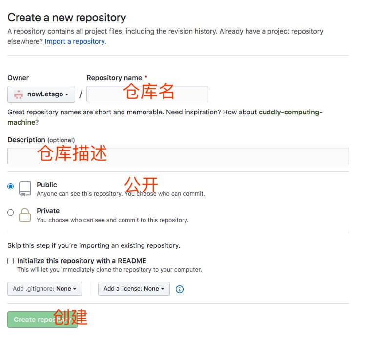
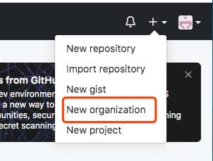
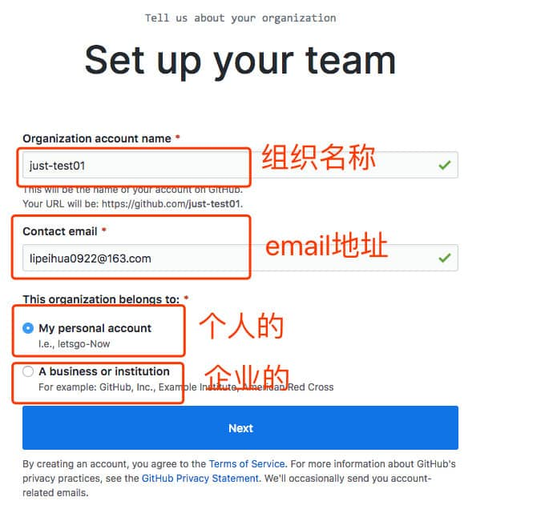
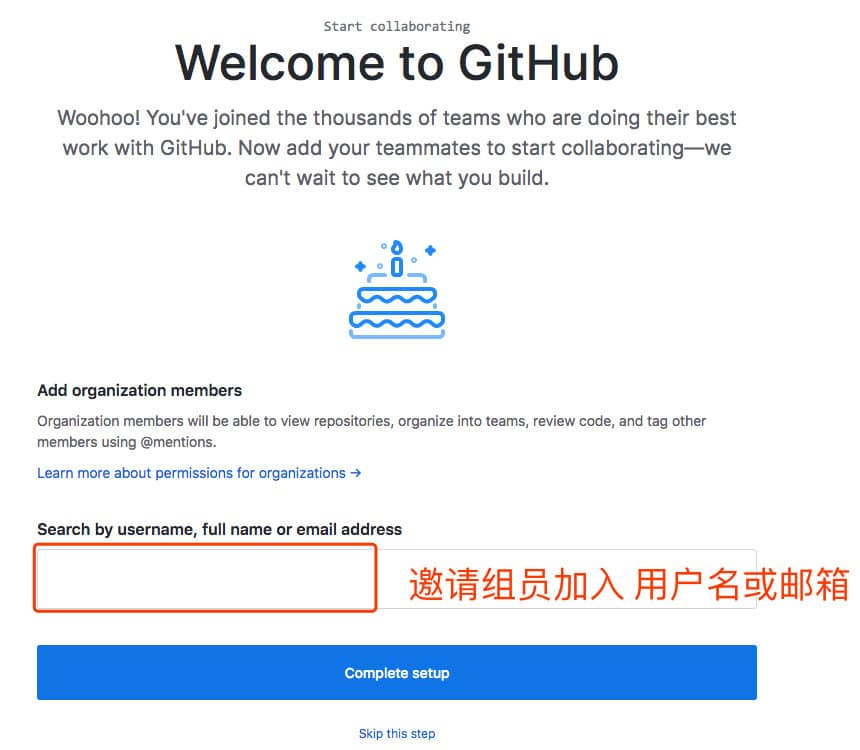
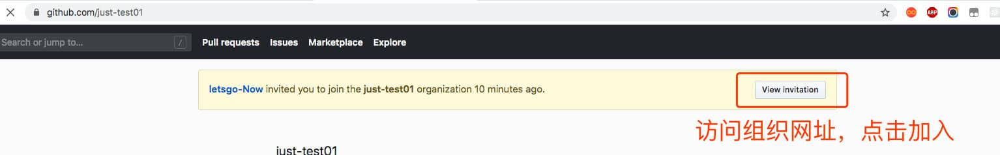

# Git

## 是什么

Git是一款开源免费的**分布式的版本控制系统**。

## 作用

版本控制系统在项目开发中作用重大，能记录文件的历史状态，主要功能有以下几点：

- 代码备份
- 版本回退
- 协作开发
- 权限控制

## 下载和安装

下载：https://git-scm.com/downloads。

安装：一直下一步。

## Linux常用命令

Linux是一套开源免费的操作系统，与系统的交互通常用命令来实现，常用的命令有：

- `ls` （list）：查看当前文件夹下的文件， `ls -al ` 或`ls -a -l`查看隐藏文件并水平排列。
- `cd` （change directory）：进入指定的文件夹，`cd ..`回到上一级，`cd /`回到根目录。
- `Tab键`：使用一些命令时，自动补全文件（夹）名。
- `clear` ：清屏。
- `mkdir` ：创建文件夹。
- `touch 文件名` ：创建一个文件。
- `rm 文件名` ：删除一个文件。
- `rm -r 文件夹名` ：删除文件夹。
- `mv 原文件或文件夹 目标文件或文件夹` ：移动或移动并重命名文件（夹）。
- `cat 文件名` ：查看文件内容。
- `ctrl+C` ：取消命令。
- 上下方向键：可以查看使用过的命令。

## Linux常用命令练习

创建以下目录结构并删除。

```md
- project
	- css
		- app.js
		- home.js
	- js
		- app.js
	- images
		- logo.png
	- index.html
```

## vim编辑器

 **vim是一款命令行下的文本编辑器**，编辑方式跟图形化编辑器不同 。

vim常用操作：

- `vim/vi 文件名`：编辑文件。（文件不存在将创建）
- `i/a/o`：进入插入模式，编辑文件内容。一般使用`i`，`i`表示在光标位置插入，`a`表示在光标处的一个文字后插入，`o`表示换行插入。
- `Esc键`+`:wq`：保存并退出。
- `Esc键`+`:q!`：不保存并退出。

  

## git 初始配置

第一次使用Git的时候，会要求我们配置用户名和邮箱，用于表示开发者的信息。

### 用户名和邮箱地址的作用

用户名和邮箱地址是本地git客户端的一个变量，不随git库而改变。

每次commit都会用用户名和邮箱纪录。

github的contributions统计就是按邮箱来统计的。

### 用户名和邮箱地址设置

```git
// 配置用户名
git config --global user.name 用户名
// 配置密码
git config --global user.email 邮箱
```

修改用户名和邮箱，也是上面的操作 ，会覆盖旧的信息。

### 查看用户名和邮箱

```git
// 查看用户名和邮箱
git config user.name
git config user.email
git config -l // 查看git所有配置
```

## 基本操作

### 基本命令

1. 创建一个空文件夹并进入。
2. 右键->点击 Git Bash Here 启动命令行（MAC 在当前文件夹打开终端）。
3. `git init` 仓库初始化。
4. 创建一个文件index.html。
5. `git add index.html` 将文件加入到暂存区
6. `git commit -m '注释'` 提交到仓库。（m 是 message 单词的缩写）

 

### 目录

  

- hooks 目录包含客户端或服务端的钩子脚本，在特定操作下自动执行。
- info 包含一个全局性排除文件，可以配置文件忽略
- logs 保存日志信息
- objects 目录存储所有数据内容,本地的版本库存放位置
- refs 目录存储指向数据的提交对象的指针（分支）
- config 文件包含项目特有的配置选项
- description 用来显示对仓库的描述信息
- HEAD 文件指示目前被检出的分支
- index 暂存区数据
- **切记： 不要手动去修改 .git 文件夹中的内容**

### 版本库的三个区域

- 工作区（代码编辑区）:代表本地开发代码的地方
- 暂存区（修改待提交区)：代表本地仓库暂时保管代码的地址
- 仓库区（代码保存区）：代表代码进入本地版本控制

  

  

## 常用命令

### 常用命令

- `git status` 版本状态查看

  红色：说明文件位于工作区

  绿色：说明文件位于暂存区

  白色：说明位于版本区

- `git add .` 添加所有新文件到暂存区（或`git add -A` 、`git add *`）

  - 使用`git restore .`可以丢弃工作区的所有改动

- `git commit -m '注释 '` 提交修改并注释

  - 使用`git restore --staged <文件名>`可以取消暂存

- `git diff` 查看工作区与暂存区的差异（不显示删除或新增文件） ，只显示做了哪些修改

  ```js
  //解读结果
  lipeihuadeMacBook-Pro% git diff
      //进行比较的是，index.html（即变动前）index.html（即变动后）。 
      diff --git a/index.html b/index.html
      //表示两个版本的git哈希值
      index 16158b4..61045cd 100644
      //"---"表示变动前的版本
      --- a/index.html
      //"+++"表示变动后的版本
      +++ b/index.html
      //代表的意思是源文件的1-2行与目标文件的1-5行有差异,下面才是具体的差异信息;
      @@ -1,2 +1,5 @@
      //-红色部分表示减少的部分,+绿色部分表示增加的部分
       index.html 
      -no 1
      +
      +
      +
      +再次修改
      //\ No newline at end of file 最后一行没有换行
      \ No newline at end of file
  ```

- `git diff --cached` 查看暂存区与仓库的差异

### 历史版本回滚

#### 查看历史版本

- `git log`

  默认不用任何参数的话，git log 会按提交时间列出所有的更新，最近的更新排在最上面。每次更新都有一个 SHA-1 校验和、作者的名字 和 电子邮件地址、提交时间，最后缩进一个段落显示提交说明。

- `git log --oneline`

  如果内容偏多， 需要使用方向键上下滚动， 按 `q` 退出

  `git log` 命令有一个选项，可以用来更改仓库信息的显示方式。该选项为 `--oneline`.

  - 每行显示一个 commit
  - 显示 commit 的 SHA-1 的前 7 个字符
  - 显示 commit 的消息

#### 根据版本号进行回滚

版本回退，只是本地的。不会影响git中央库中的内容。

- `git reset --hard  b815fd5a6ae655b521a31a9`

  进行版本回退时，不需要使用完整的哈希字符串，**前七位即可**

  **版本切换之前，要提交当前的代码状态到仓库**

- `git reflog`

  如果在回退以后又想再次回到之前的版本，git reflog 可以查看所有分支的所有操作记录（包括commit和reset的操作），包括已经被删除的commit记录，git log则不能察看已经删除了的commit记录

#### 其他回滚（了解）

```sh
git reset --hard HEAD^    回滚到上个版本
git reset --hard HEAD^^   回滚到上上个版本
git reset --hard HEAD~100   回滚到100个版本之前
```

## 配置忽略文件

### 仓库中没有提交该文件

项目中有些文件是不需要进入版本库中，比如编辑器的配置。Git 中需要创建一个文件 ==.gitignore==，一般与 .gitignore 同级目录。

```gitignore
# 忽略所有的 .idea 文件夹
.idea
# 忽略所有以 .test 结尾的文件
*.test
# 忽略 node_modules 文件和文件夹
/node_modules
```

### 仓库中已经提交该文件

1. 对于已经加入到版本库的文件，可以在暂存区中删除该文件。（因为不能直接从本地库删除‘）

   ```sh
   git rm --cached .idea
   git rm --cached ./css/go.css
   ```

2. 然后在`.gitignore`中配置忽略

   ```sh
   .idea
   /css/go.css
   ```

3. add 和 commit 提交即可

## 分支

分支是 Git 重要的功能特性之一，开发人员可以在主开发线的基础上分离出新的开发线。

### 创建分支

基于当前分支创建的分支，创建的分支未操作修改前与当前分支数据一样，相当于是复制出来的。作用是可以快速基于当前分支的数据进行开发。

```sh
git branch 分支名
```

### 查看所有分支

`*`前缀代表当前所在分支。

```sh
git branch
```

### 切换分支

```sh
git checkout 分支名
```

### 合并分支

将指定分支合并到当前分支。

```sh
git merge 分支名
```

### 删除分支

```sh
git branch -d 分支名
```

### 切换并创建分支

```sh
git checkout -b 分支名
```

**注意: 每次在切换分支前提交一下当前分支**

### 冲突

当多个分支修改同一内容后，合并分支的时候就会产生冲突。冲突的解决非常简单，打开冲突的文件，将内容修改为最终想要的结果，然后继续执行 git add 与 git commit 就可以了。

# GitHub

## 基本使用

### 介绍

GitHub 是一个 Git 仓库管理网站。可以创建远程中心仓库，为多人合作开发提供便利。

### 使用流程

GitHub 远程仓库使用流程较为简单，主要有以下几种场景：

- 本地有仓库
- 本地没仓库

### 本地有仓库

1. 注册并激活账号

2. 创建 GitHub 中心仓库

     

3. 获取仓库的地址

     

4. 本地配置远程仓库的地址，并取别名为`origin`方便操作。

   ```shell
   git remote add origin https://github.com/nowLetsgo/test.git
       // 远端仓库管理 添加一个远程仓库的url的别名
       // add  添加
       // origin 远端仓库的别名（git remote -v 可以查看仓库所有的别名）
       // https://github.com/nowLetsgo/test.git	仓库地址
       // git remote可以添加删除重命名等操作（使用 git remote -h查看）
   ```

5. 本地提交（确认代码已经提交到本地仓库）

6. 将本地仓库某个分内容推送到远程仓库

   ```shell
   git push -u origin master
       //
       push 推送
       -u   关联, 加上以后,后续提交时可以直接使用 git push
       origin 远端仓库的别名
       master 本地仓库的分支
   ```

### 本地没有仓库

1. 注册并激活账号

2. 克隆仓库

   ```shell
   git clone https://github.com/nowLetsgo/test.git [name]
   //name 是对仓库名字的修改
   ```

3. 增加和修改代码

4. 拉取本地没有的分支

   ```js
   git fetch origin dev:dev
   ```

1. 本地提交

   ```shell
   git add .
   git commit -m 'message'
   ```

2. 推送到远程

   ```shell
   git push
   ```

> 克隆代码之后， 本地仓库会默认有一个远程地址的配置， 名字为 origin

## 多人合作

### 账号仓库配置

GitHub 团队协作开发也比较容易管理，可以创建一个组织

1. 首页 -> 右上角 `+` 号-> new Organization



1. 免费计划


1. 填写组织名称和联系方式（不用使用中文名称）



1. 被邀请者加入方式1：


1. 被邀请者加入方式2：



1. 配置组织权限，组织首页右侧 settings -> Member privileges -> 选择 write （设置成员可写）


1. 组织创建完毕后，在组织中创建仓库


1. 练习

   ```md
   组长创建一个组织仓库
   组员需要在仓库名中创建一个以自己名字命名的html文件
   创建完成后提交到远程仓库
   
   注意：
   组织权限要配置好，否则提交会出现403
   关于克隆，一定要在一个非git仓库文件夹进行
   ```

2. git复习

   

## 协作流程

### 入职第一天

- 得到 Git 远程仓库的地址和账号密码

- 将代码克隆到本地（地址换成自己的）

  ```shell
  git clone https://github.com/xiaohigh/test.git
  ```

- 切换分支

  ```
  git checkout -b xiaohigh
  ```

- 开发代码

- 本地提交

  ```shell
  git add -A
  git commit -m '注释内容'
  ```

- 合并分支

  ```shell
  git checkout master
  git merge xiaohigh
  ```

- 更新本地代码

  ```shell
  git pull
  //或者使用下面两行代码
  git fetch 
  git merge origin/master
  ```

- 提交代码

  ```shell
  git push 
  ```

### 第二天工作流程

1. 更新代码 (git pull)
2. 切换分支
3. 开发功能
4. 提交
5. 合并分支
6. 更新代码
7. 提交代码

### 冲突解决

同分支冲突一样的处理，将代码调整成最终的样式，提交代码即可。

## 免密登录

1. 创建非对称加密对

   ```sh
   ssh-keygen //在任意位置输入命令即可
   ```

2. 文件默认存储在家目录（c:/用户/用户名/.ssh）的 .ssh 文件夹中。

   - id_rsa 私钥
   - id_rsa.pub 公钥

3. 将公钥（.pub）文件内容配置到账号的秘钥中

   - 首页 -> 右上角头像-> settings -> SSH and GPG keys -> new SSH Key

4. 克隆代码时，选择 ssh 模式进行克隆 （地址 在仓库首页 绿色 克隆的位置 选择 use ssh）

   ```shell
   git clone git@github.com/xiaohigh/team-repo-1.git 
   ```

5. 克隆代码时的提醒，这里需要输入 yes

## GitFlow

GitFlow 是团队开发的一种最佳实践，将代码划分为以下几个分支


- Master 主分支。上面只保存正式发布的版本
- Hotfix 线上代码 Bug 修复分支。开发完后需要合并回Master和Develop分支，同时在Master上打一个tag
- Feather 功能分支。当开发某个功能时，创建一个单独的分支，开发完毕后再合并到 dev 分支
- Release 分支。待发布分支，Release分支基于Develop分支创建，在这个Release分支上测试，修改Bug
- Develop 开发分支。开发者都在这个分支上提交代码